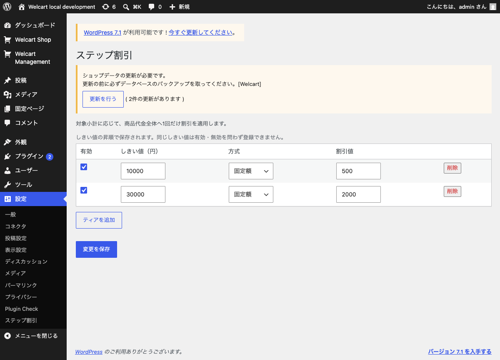
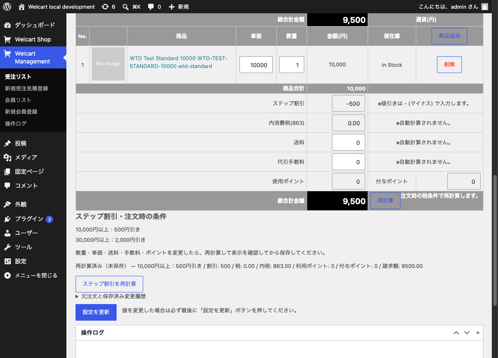
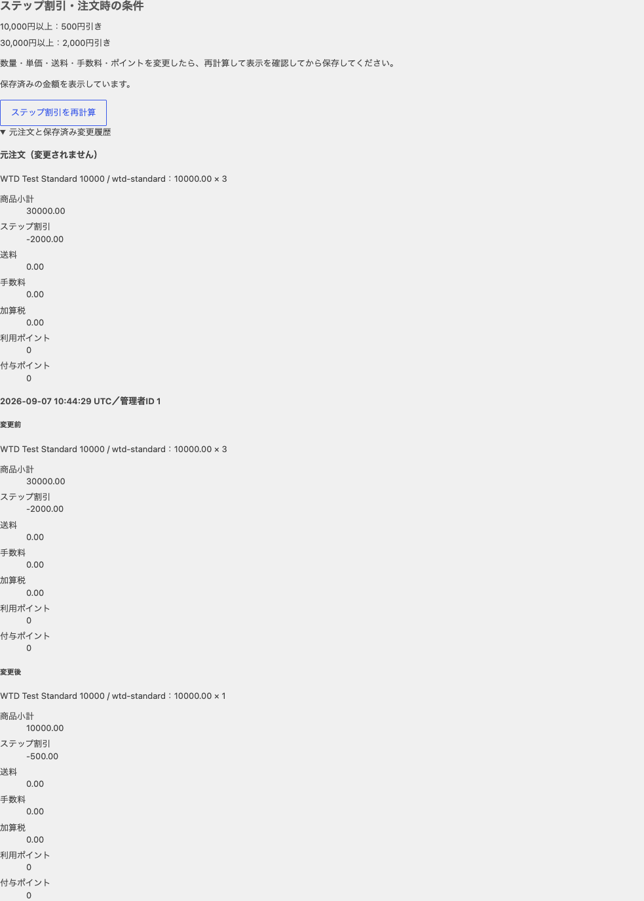

## 1. 実装範囲と受入れ

:::lead
Issue #4本文v5に基づき、割引の計算だけでなく、確認画面と保存値の対応まで実装した。
:::

主環境の受入れ完了・補助環境の制約を記録

| 項目 | 実装した内容 |
|---|---|
| 設定 | 全商品対象の1一覧。固定額／割合、有効／無効、しきい値昇順、全体検証と旧設定保持 |
| 計算 | 登録販売価格×数量。最高しきい値の1段、非累積、割合の円未満切捨て、商品代金を上限 |
| 購入 | カート・確認・保存へ同じ割引。確認後の条件変更では再確認 |
| 受注編集 | 注文時の全ティア、現在入力に対応するプレビュー、保存時の再検証、元注文と前後履歴 |
| 保存失敗 | 対象注文の明細・金額・税・記録を同一トランザクションで保存。失敗時は巻き戻す |

仕様の正本は[機能仕様](../../../SSoT/FUNCTIONAL_SPEC.md)、再現手順は[README](../../../../README.md)に置く。
この資料は、採用理由、検証結果、AIが誤った箇所を説明する。

| 計画の対応 | 受入証拠 |
|---|---|
| G1 / C1 / V1 | 最小の関数構成、標準 quality、配布 ZIP の新規展開・全 10 ファイル照合 |
| G2 / C2・C5 / V2 | Settings の全体検証と権限別 HTTP、設定操作の実画面 |
| G3 / C3 / V3 | 最高しきい値の単一選択、非累積、端数・上限の純粋テストと Red/Green |
| G4 / C4 / V4・V5 | native 税・ポイント・購入・メール・会員履歴、F1、保存故障、同時編集 |
| G5 / C6 / V6 | 独立レビュー、補助環境試行、有効化切替、Plugin Check の制約、README・本資料・画像 |

配布物 `dist/welcart-tiered-discounts-1.0.0.zip` は plugin ソース・readme・GPL ライセンスの全 10 ファイル。新しい展開先で各ファイルのバイト一致と ZIP CRC、開発資材が入らないことを確認した（Python zipfile、exit 0）。ZIP は生成物、GitHub 上の `plugin/` が配布ソースの正本である。

## 2. 設計メモ

:::lead
Welcartの既存金額列を請求額の正本とし、独自テーブルを追加しない。
:::

| 場所 | 役割 | この分け方を選んだ理由 |
|---|---|---|
| `includes/discount.php` | 小計とティア計算 | WordPressを起動せず、境界値と端数を検証できる |
| `includes/settings.php` | Settings API、入力検証、管理画面 | nonce・権限・保存先をWordPress標準へ接続できる |
| `includes/welcart.php` | 登録価格、税配分、確認token | 既存の合計・ポイント・購入開始の順序へ接続する |
| `includes/orders.php` | 読取プレビュー、保存検証、元注文と履歴 | 注文1件の保存前後を一つの境界で扱える |
| `assets/` | 設定行と受注プレビューの操作 | 既存フォームを使い、変更後の再確認を促す |

**確認token**は、表示した条件と結果をサーバーで照合するための値である。
購入確認ではセッション内の表示状態と比較し、管理者編集では受注ID・管理者ID・保存済み受注の版・検証済み入力と計算結果を署名する。
別の管理者による更新はDBの版で検出し、同じ画面内の数量変更は確認tokenで検出する。

| 比較した方法 | 採否と理由 |
|---|---|
| 最後に合計の表示文字列だけ変更 | 不採用。税・ポイント・受注列が元の値のまま残る |
| 既存discountへ毎回加算 | 不採用。再計算のたびに割引が累積する |
| 適用した1段だけ注文へ保存 | 不採用。後日の数量減少で下位段へ戻れない |
| 最新の店舗設定で過去注文を計算 | 不採用。購入時の条件を保持できない |
| 標準AJAXを計算関数として呼ぶ | 不採用。JSON出力で終了し、税率変更時には保存前でもDBを更新する |
| 保存後の読戻しだけで検証 | 不採用。履歴書込み失敗の時点で金額だけ確定してしまう |

採用したフック・関数の全一覧、引数、対象版のソース位置は[連携一覧](../../../SSoT/INTEGRATIONS.md)を参照する。
税率別割引をWelcartのtax singletonへ同期する部分は2.12.1の実装に依存するため、他版を無条件には保証しない。

## 3. 数値と保存の検証

:::lead
純粋な計算テストと、実WordPress・Welcartを経由する保存試験を分けた。
:::

税端数は切捨て、税計算対象は商品、送料・手数料は0を基準とする。
税率混合では標準税率の商品6,000円と軽減税率の商品4,000円に、割引500円を300円／200円へ配分する。

| 入力 | 割引 | 税 | 請求額 | 実測 |
|---|---:|---:|---:|---|
| 税込10%、商品10,000円 | 500 | 内税863 | 9,500 | 確認・新規保存・注文時の記録が一致 |
| 税抜10%、商品10,000円 | 500 | 外税950 | 10,450 | ネイティブ保存と編集計算が一致 |
| 税込10%／8%混合 | 500 | 内税799 | 9,500 | ネイティブ保存と税率別メタを確認 |
| 税抜10%／8%混合 | 500 | 外税874 | 10,374 | 税メタ570／304を確認 |
| 税込10%、1,000ポイント利用 | 500 | 内税863 | 8,500 | HTTP購入・メール・会員履歴が一致 |

金額はWelcartの小数2桁の列で保存できる範囲へ限定する。
純粋計算では10進文字列のまま積和を求め、保存時は入力が列の精度と上限を満たすか確認する。
追加商品のチェックボックスと全明細削除も、Welcartの実関数を通して検証した。

### 実行結果

| 確認 | コマンド・対象 | 結果 |
|---|---|---|
| 規約・単体 | `composer quality`（純粋試験モード） | exit 0、68 tests / 96 assertions、PHPCS指摘0 |
| 購入HTTP | `composer phpunit -- --group integration tests/CheckoutHttpTest.php` | 通常購入・会員履歴 4 tests / 193 assertions。追加の故障購入 1 test / 21 assertions、いずれも exit 0。最終全体試験にも含む |
| 保存税マトリクス | `NativeOrderStorageTest --filter native_saved_tax_matrix` | exit 0、4 tests / 36 assertions |
| 新規保存失敗 | `NativeOrderStorageTest --filter snapshot_write_failure` | exit 0、1 test / 7 assertions。注文・在庫・会員ポイント・セッションを復元 |
| 数値・選択肢の保存境界 | `OrderNativeEdgeTest` | exit 0。小数価格・数量、桁超過、追加選択肢、空注文を確認 |
| 独立レビュー | GPT-5.6 Terra / medium | 確定した実装欠陥なし。未実施の検証は別途実行 |

最終回帰は標準入口 `./scripts/dev.sh recommended integration` が **exit 0、52 tests / 779 assertions**、`./scripts/dev.sh recommended quality` が **exit 0、68 tests / 96 assertions**。Composer validate / platform requirements、lint、PHPCS/WPCS を含む。統合試験には管理保存の SQL 故障、二人の同時編集、新規会員購入の故障時に注文・在庫・ポイント・メールが不変であることを含む。

[全体統合試験](evidence/integration-full-final.txt)／[標準品質検査](evidence/quality-standard-final.txt)。最初の全体実行では WP とテスト側の異なる mount path から同じ PHP を二重読込して exit 255 となった。テスト bootstrap に純粋処理の読込みを集約し、修正後の標準入口を再実行した。

有効→無効→再有効を WP-CLI で実施（全操作 exit 0）。無効時は関数・割引 hook が未登録で入力値に介入せず、設定と注文 1037 の snapshot の SHA-256 は 3 段階で一致した。試験後は C の通常構成を復元し、Web / quality とも `WTD_TEST_MODE=1` と試験用 MU bind が無いことを確認した。
成功件数が出ない `wp_die` の終了コード0を誤って成功としないよう、統合試験bootstrapでは例外へ変換する。

### TDD の追跡

同じ振る舞いの失敗を先に確認し、修正後と整理後に再実行した。以下のファイル名はこの資料の `evidence/` に保存した実行出力に対応する。終了コード 0 だけでなく PHPUnit の完了行と件数も確認した。環境接続失敗や途中終了は Red の代わりに数えない。

再実行入口は `./scripts/dev.sh recommended integration <テストファイル> --filter <メソッド名>`。稼働中の C を再作成しない実行では `docker exec -w /workspace welcart-tiered-discounts-c-quality-1 composer phpunit -- --group integration` に同じ対象を渡した。表の対象はログ内の PHPUnit メソッド名で一意に特定できる。

| 振る舞い | Red（exit 1）と失敗理由 | Green（exit 0）と修正 |
|---|---|---|
| native 再計算と登録価格 | [native-cart-red.txt](evidence/native-cart-red.txt): D が 0、期待 −500 | [welcart-green.txt](evidence/welcart-green.txt): 12 tests / 55 assertions。登録 SKU 価格と税クラスの割引内訳を同期 |
| 未確認数量の保存拒否 | [admin-save-red-verified.txt](evidence/admin-save-red-verified.txt): HTTP 200、期待 409 | [admin-save-green.txt](evidence/admin-save-green.txt): 3 tests / 15 assertions。保存前の確認 token 検証 |
| 金額改ざんと履歴 | [admin-history-red.txt](evidence/admin-history-red.txt): −123456 が保存、期待 −500 | 同上。確認済みのサーバー計算を native 入力へ渡して履歴を追記 |
| 商品の未保存追加 | [admin-add-red.txt](evidence/admin-add-red.txt): native AJAX が HTTP 200 で即保存 | [admin-add-guard-green.txt](evidence/admin-add-guard-green.txt)。追加を署名付き draft とし確定保存まで保留 |
| 取消と金額変更 | [admin-cancel-red.txt](evidence/admin-cancel-red.txt): 状態が noreceipt のまま | [admin-cancel-green.txt](evidence/admin-cancel-green.txt)。native の早期 return より前に金額を同一 transaction 内で保存 |
| 新規商品の選択肢 | [new-options-red.txt](evidence/new-options-red.txt): チェックボックス値が空 | [new-options-green.txt](evidence/new-options-green.txt)。新規 cartmeta ID に選択値を引継ぎ |
| 全明細削除の小計 | [empty-native-red.txt](evidence/empty-native-red.txt): 0 のはずが管理者カートの 10000 | [native-edge-buffer-green.txt](evidence/native-edge-buffer-green.txt): 3 tests / 11 assertions。空明細の native fallback を遮断 |
| 全明細削除のポイント | [empty-cart-red.txt](evidence/empty-cart-red.txt): 0 のはずが 42 | [empty-cart-green.txt](evidence/empty-cart-green.txt)。金額変更で空明細になった付与ポイントを 0 にする |
| 元注文の構造検証 | [snapshot-shape-red.txt](evidence/snapshot-shape-red.txt): 欠落した元金額を受理 | [snapshot-shape-green.txt](evidence/snapshot-shape-green.txt)。元の全 8 金額項目を検証 |
| 税メタの読戻し | [tax-meta-readback-red.txt](evidence/tax-meta-readback-red.txt): 必須メタ欠落を受理 | [tax-meta-readback-green.txt](evidence/tax-meta-readback-green.txt)。全必須税メタの存在・値を照合 |

整理後の回帰結果は本節の最終実行結果に集約する。追加の legacy／破損受注／他受注 nonce の HTTP 確認は実装済み保護の受入試験で、後付けの Red を作ったとは記録しない（1 test / 12 assertions、exit 0）。

## 4. 画面確認

:::lead
追加した操作と、再計算後の金額を実ブラウザで確認する。
:::

- 設定画面: 行追加・削除、有効切替、固定額／割合切替、キーボード移動、正常保存を確認。
- 重複しきい値: 旧設定を保持し、エラー通知を1件表示することを確認。
- 管理者編集: 専用ダミー受注 1037 で F1 を実施。数量 3 のプレビュー後に数量 1 へ変更して保存を試みると再計算を要求し、DB は数量 3・割引 2,000 円・履歴 0 件のまま。再計算で割引 500 円・内税 863 円・請求 9,500 円を表示し、保存後の DB と履歴 1 件の変更後値も一致。snapshot の元注文は数量 3・割引 2,000 円・請求 28,000 円を維持。

以下は C の実画面で、商品・会員・受注は検証専用のダミーデータ。生成 UI 案を動作証拠として使っていない。

[保存後の受注全体とnative操作ログを確認する](images/c-order1037-saved-history.png)。顧客欄の Test Buyer と example.test は検証専用値。

## 5. AI活用レポート

:::lead
AIの提案は、実ソースと失敗するテストで確かめてから採用した。
:::

Codexが仕様の読み合わせ、連携実装、検証と文書化を担当した。
Luna Maxの担当には計算・設定・HTTP試験・画面確認など、入力と所有ファイルが決まる作業を分けた。
採用判断は主担当が持ち、Terra mediumの独立レビューでは要求と保存境界を確認した。

| AI出力・作業上の誤り | 発見方法 | 修正 |
|---|---|---|
| 商品追加後の通常保存でチェックボックスが消える | ネイティブ更新を通すテストが空文字で失敗 | 商品名キーの選択肢を、追加後のcartmeta IDへ引き継ぐ |
| 全明細削除後の小計が管理者の買い物カートになる | `get_total_price([])` の実測が10,000円になった | 空の受注を保存する境界でカートを空にし、失敗時はセッションを復元 |
| 全明細削除後にも付与ポイントが残る | 42ポイントが0にならないテスト | 空明細の付与ポイントを0にする |
| 同じ設定エラーを二重に表示 | 実ブラウザで重複行を送信 | Settings APIの複数回検証でも同じエラーを重複登録しない |
| PHPの検査だけでJS規約まで通過したと思い込む | `composer quality` がJSの規約違反を報告 | 両JSをPHPCS対象として整形し、Nodeの構文検査も実施 |
| 統合構成と通常構成を並行起動して試験用設定を失う | Webの環境変数・MU bindとquality側の不一致 | 正式なintegration構成を復元し、既存コンテナで試験を実行 |
| `wp_die` で試験途中にexit 0となる | PHPUnitの件数・完了行がないことを確認 | 試験bootstrapで例外に変換し、未完了を失敗として検出 |

公開リファレンスだけでは、保存順序や税クラスの状態初期化までは判断できなかった。
対象版のソースを読み、実際の購入と受注保存を通す作業に時間を要した。
このため、補助環境の失敗を隠すための再試行や、公称対応版の引上げは行っていない。

## 6. 保証範囲と残る制約

:::lead
実測した構成と、今回確認できなかった構成を分ける。
:::

| 対象 | 結果と制約 |
|---|---|
| 主受入れ環境C | WordPress 7.0.4 / Welcart 2.12.1 / PHP 8.3.33 / MySQL 8.4.11 |
| minimum | WordPress 5.6.19 / Welcart 2.12.1 / PHP 7.4.33 / MySQL 5.5.62。有効化と固定額計算、native カート→確認ゲート→注文保存は成功（専用注文 1、商品 10,000／割引 500／請求 9,500、exit 0）。HTTP ブラウザとメール本文は未確認 |
| latest | WordPress 7.1 / PHP 8.5.9 / DB image mysql:26.7.0。既存volumeの認証不一致でmysqli 1045。有効化・購入試験は失敗 |
| Plugin Check | 実行結果と残る掲載用指摘は最終集約時に記載。実際に未検証の版を `Tested up to` へ記載しない |
| 外部決済・メール | 実取引・実配送は未実施。ローカル振込方式と送信捕捉で金額を確認 |
| 併用・後続機能 | 他割引との併用保証、日英翻訳の完成、カテゴリ・会員ランク指定はMVP対象外 |

補助環境は停止し、volumeを保持した。minimum の初回確認が純粋計算だけだったため、不足していた native 購入経路を 1 回追加試行した。成功しても主環境の全 HTTP 検証と同等とは扱わない。
検証用の会員・商品・受注はローカル環境に残し、本番データや外部サービスを使っていない。
